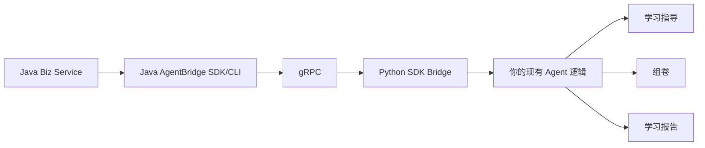
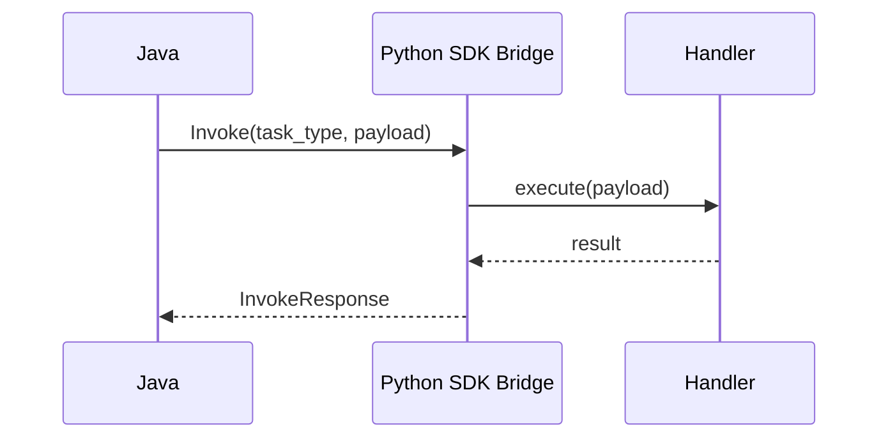
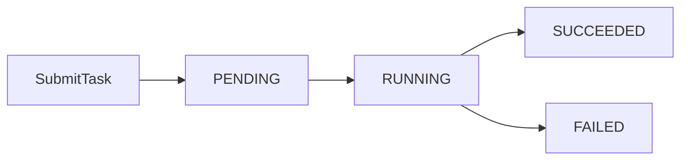
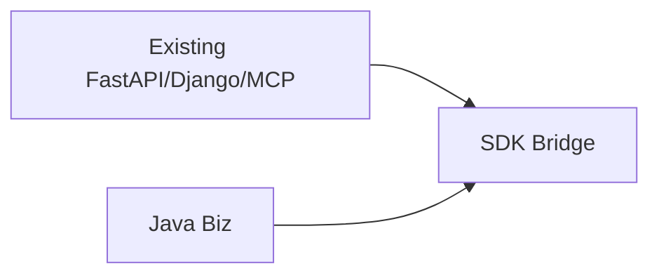

# easy-java-agent-sdk 使用指南（详细版）

> 目标：在**尽量不改原有 Python Agent 代码**的前提下，让 Java 业务端（Maven 插件/SDK）通过 AgentBridge gRPC 协议直接调用你的能力。

---

## 1. 这是什么

`easy-java-agent-sdk` 是一个 Python 适配层，核心价值：

1. 不强制你重写 Agent 框架（FastAPI/Django/MCP 均可共存）
2. 只需注册能力函数，即可被 Java 端探测与调用
3. 同时支持：
- 同步调用（Invoke）
- 流式调用（InvokeStream）
- 异步任务（SubmitTask/GetTaskStatus）

---

## 2. 架构图（图文）





---

## 3. 目录结构

```text
python-agent-sdk/
  easy_java_agent_sdk/
    __init__.py
    app.py
    capability.py
    proto/
      agent_bridge.proto
      __init__.py
  examples/
    minimal_agent.py
  scripts/
    gen_proto.py
  pyproject.toml
  requirements.txt
  README.md
```

---

## 4. 安装与初始化

## 4.1 安装依赖

```bash
pip install -r requirements.txt
```

## 4.2 生成 gRPC Python 代码

```bash
python scripts/gen_proto.py
```

## 4.3 本地可编辑安装

```bash
pip install -e .
```

---

## 5. 5 分钟最小可跑 Demo

```python
# quick_start.py
import json
from easy_java_agent_sdk import AgentBridgeApp

app = AgentBridgeApp(agent_name="k12-assistant", agent_version="1.0.0")

@app.capability(
    name="study_plan.generate",
    description="Generate study plan",
    input_schema_json='{"type":"object"}',
    output_schema_json='{"type":"object"}'
)
def generate_plan(payload_json: str) -> dict:
    payload = json.loads(payload_json or "{}")
    return {
        "grade": payload.get("grade", "6"),
        "subject": payload.get("subject", "math"),
        "plan": [
            "Review previous mistakes",
            "Practice key topic for 30 minutes",
            "Quiz and reflection"
        ]
    }

if __name__ == "__main__":
    app.run(host="0.0.0.0", port=50051)
```

启动：

```bash
python quick_start.py
```

---

## 6. 实战 Demo：中小学学习助手

下面给出一个更完整的能力集合（学习指导 + 组卷 + 报告摘要）。

```python
# demo_k12_agent.py
import json
import random
from datetime import datetime
from easy_java_agent_sdk import AgentBridgeApp

app = AgentBridgeApp(agent_name="school-learning-assistant", agent_version="1.0.0")


@app.capability(
    name="learning.guide",
    description="Learning guidance by student profile",
    input_schema_json='{"type":"object"}',
    output_schema_json='{"type":"object"}'
)
def learning_guide(payload_json: str) -> dict:
    p = json.loads(payload_json or "{}")
    weak_points = p.get("weak_points", ["fractions", "word-problems"])
    return {
        "student_id": p.get("student_id", "S-001"),
        "daily_tasks": [
            f"Target practice: {weak_points[0]} (20 min)",
            "Error notebook review (15 min)",
            "Teacher Q&A video recap (10 min)"
        ],
        "next_review_date": "2026-06-05"
    }


@app.capability(
    name="paper.generate",
    description="Generate quiz paper by level and weak points",
    input_schema_json='{"type":"object"}',
    output_schema_json='{"type":"object"}'
)
def paper_generate(payload_json: str) -> dict:
    p = json.loads(payload_json or "{}")
    difficulty = p.get("difficulty", "medium")
    topic = p.get("topic", "fractions")
    q_count = int(p.get("question_count", 10))
    questions = []
    for i in range(q_count):
        questions.append({
            "id": f"Q{i+1}",
            "type": random.choice(["single-choice", "fill-blank", "short-answer"]),
            "topic": topic,
            "difficulty": difficulty,
            "score": 10
        })
    return {
        "paper_id": f"P-{datetime.now().strftime('%Y%m%d%H%M%S')}",
        "total_score": sum(q["score"] for q in questions),
        "questions": questions
    }


@app.capability(
    name="report.generate",
    description="Generate learning report summary (video refs included)",
    input_schema_json='{"type":"object"}',
    output_schema_json='{"type":"object"}'
)
def report_generate(payload_json: str) -> dict:
    p = json.loads(payload_json or "{}")
    return {
        "student_id": p.get("student_id", "S-001"),
        "period": p.get("period", "2026-W22"),
        "accuracy": 0.82,
        "improvement": [
            "Calculation stability improved",
            "Word-problem parsing still weak"
        ],
        "video_recommendations": [
            {"title": "Fraction Essentials", "video_id": "VID-101"},
            {"title": "Word Problem Strategy", "video_id": "VID-204"}
        ]
    }


if __name__ == "__main__":
    app.run(host="0.0.0.0", port=50051)
```

---

## 7. 流式返回 Demo

当你希望“边生成边返回”（例如分步生成学习计划）时：

```python
import json
from easy_java_agent_sdk import AgentBridgeApp

app = AgentBridgeApp("streaming-agent", "1.0.0")

@app.capability(name="study_plan.generate", supports_streaming=True)
def plan(payload_json: str) -> dict:
    return {"final": "fallback-final-result"}

@app.stream_capability("study_plan.generate")
def plan_stream(payload_json: str):
    payload = json.loads(payload_json or "{}")
    yield {"stage": "analyzing", "subject": payload.get("subject", "math")}
    yield {"stage": "retrieving_knowledge", "count": 12}
    yield {"stage": "drafting_plan", "progress": 80}
    yield {"stage": "done"}

if __name__ == "__main__":
    app.run(port=50051)
```

---

## 8. 异步任务 Demo

SDK 已支持异步接口（Java 侧 `invoke-async/task-status` 可直接调用）：

1. Java 发起 `SubmitTask`
2. Python 后台执行
3. Java 轮询 `GetTaskStatus`



---

## 9. 与原系统共存（零侵入建议）

推荐部署方式：

1. 保留你原有的 FastAPI/Django/MCP 服务不动
2. 新起一个 `SDK Bridge` 进程（例如 `:50051`）
3. Bridge 内部调用你现有业务函数/服务
4. Java 只连 Bridge，不直接连你的内部系统



---

## 10. Java 侧联调命令

```bash
java -jar agent-bridge-cli-all.jar probe --host 127.0.0.1 --port 50051
java -jar agent-bridge-cli-all.jar list-capabilities --host 127.0.0.1 --port 50051
java -jar agent-bridge-cli-all.jar invoke --task-type learning.guide --payload "{\"student_id\":\"S-001\"}"
java -jar agent-bridge-cli-all.jar invoke-stream --task-type study_plan.generate --payload "{\"subject\":\"math\"}"
java -jar agent-bridge-cli-all.jar invoke-async --task-type report.generate --payload "{\"student_id\":\"S-001\"}"
java -jar agent-bridge-cli-all.jar task-status --task-id <task_id>
```

---

## 11. 常见问题

## 11.1 报错 `gRPC stubs missing`

先执行：

```bash
python scripts/gen_proto.py
```

## 11.2 Java 调用无能力返回

检查：

1. 是否正确注册了 `@app.capability(...)`
2. `task_type` 是否与 Java 传入一致
3. 服务是否监听在 `50051`

## 11.3 流式没返回

检查：

1. 是否定义了 `@app.stream_capability("same.task.type")`
2. Java 侧是否使用 `invoke-stream`

---

## 12. 生产建议

1. 与 Java 端共享同一份 `agent_bridge.proto`
2. 为每个 capability 定义清晰的输入/输出 schema
3. 将 Bridge 作为独立进程部署，便于扩缩容
4. 配合 TLS/JWT（在统一桥接包中可用）进行安全加固

---

如果你希望，我下一步可以基于这份 README 再补一套：

1. `FastAPI 接入模板`
2. `Django 接入模板`
3. `MCP Server 接入模板`

每套都给“可直接运行”的完整文件级示例。
